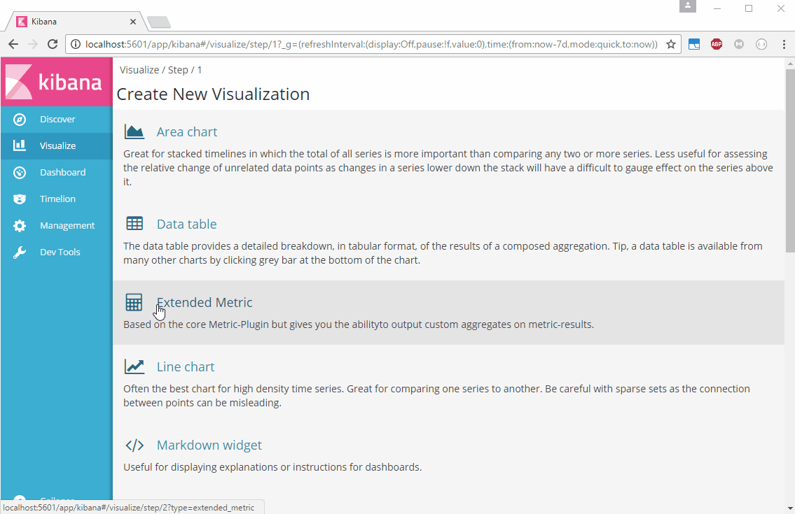

# Kibana Extended Metric Plugin

This is a plugin for [Kibana 5.0.0](https://www.elastic.co/products/kibana).
It is based on the core Metric-Plugin but gives you the ability to output custom aggregates on metric-results by using custom formula and/or JavaScript.



## Installation
(only works for Kibana 5.0.0)

```sh
$ ./bin/kibana-plugin install https://github.com/ommsolutions/kibana_ext_metrics_vis/releases/download/0.1.0/extended_metric_vis.zip
```

### Manual
(for other versions: e.g. 5.1.0)

Extract the ZIP into a new folder in your `kibana/plugins`-directory.

## Uninstall

Simply delete that folder and restart kibana.
